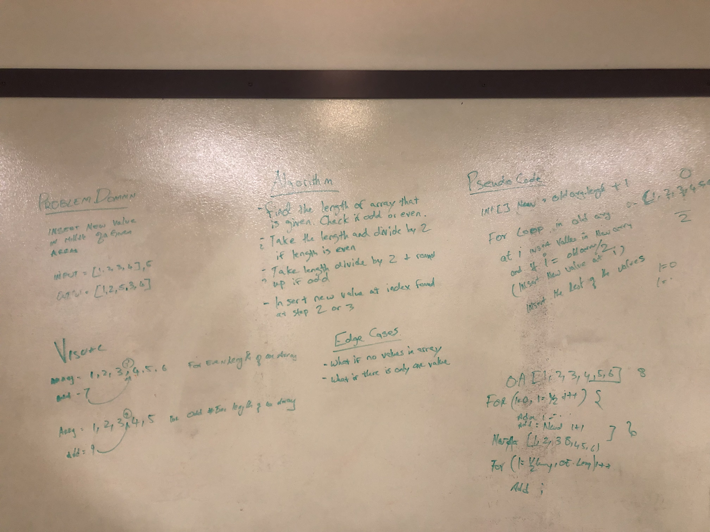

# Array Shift
## Challenge Summary
In this challenge we were given an array and a integer value. Next we needed to insert that value into the middle of that array.

## Challenge Description
Inserting a given value into the middle of a given array and then making the second half of the array shift over one.

## Approach & Efficiency
I took the approach of running a for loop for the first half of the array and putting those values into the new array. Then I took the given value and inserted it into the new array. Finally I ran another for loop to insert the second half of the values into the new array.

## Solution

