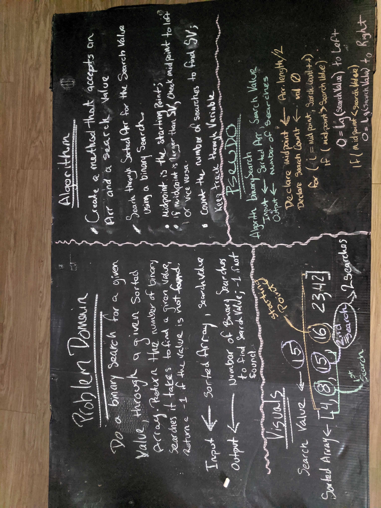

# Binary Search
## Challenge Summary
In this challenge we were given a sorted array and a search key. The task was to return the index of the array’s element that is equal to the search key, or -1 if the element does not exist.

## Challenge Description
Find and return the index of the array’s element that is equal to the search key, or -1 if the element does not exist.

## Approach & Efficiency
Compare the search key with the middle element.
If the key matches with middle element, we return the middle index.
Else If the key is greater than the middle element, then the key can only lie in right half after the middle element.
Else (the key is smaller) then the key can only lie in right half after the middle element.

## Solution

- [Binary Search Code](./src/main/java/Java/BinarySearch)

- [Binary Search Test](./src/test/java/Java/BinarySearchTest)