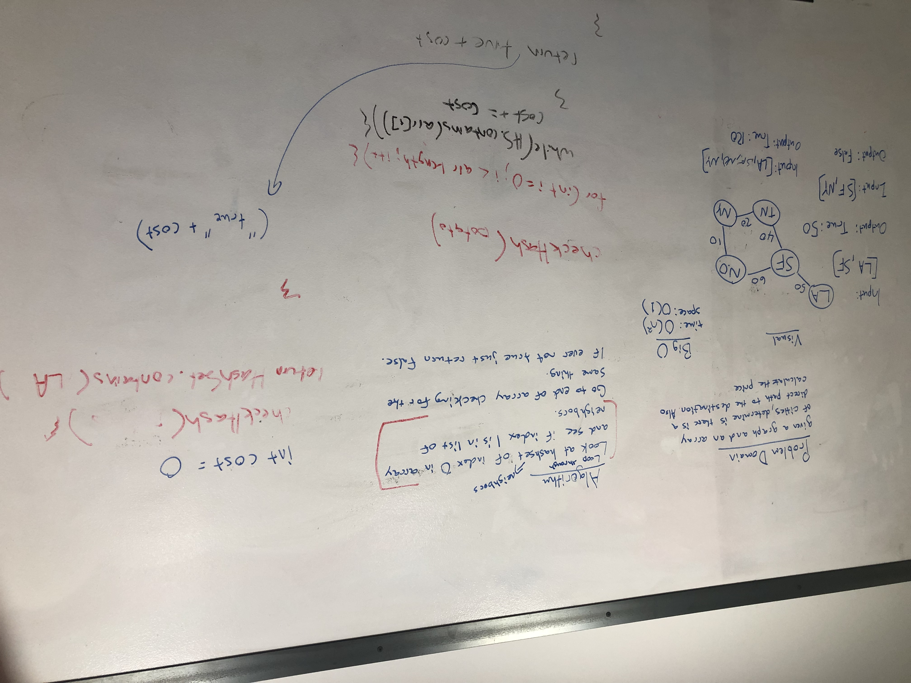

# Get Edge
- Given a business trip itinerary, and an Alaska Airlines route map, is the trip possible with direct flights? If so, how much will the total trip cost be?

## Challenge
- A function which takes in a graph, and an array of city names. 
- Without utilizing any of the built-in methods available to your language, return whether the full trip is possible with direct flights, and how much it would cost.

## Algorithm
- Loop through the hashset(neighbors) of index 0 and see if it contains index 1
- Iterate along the length of the array checking for the same thing
- If it is ever false then we return "no direct route"
- If it is true then we continue to += the cost to return 

## Approach & Efficiency
- Time efficiency would be O(n^2)
- Space efficiency would be O(1)

## API and Acknowledgements
- GetEdge(boolean output, int cost)
- Will Fritts for helping with the code and the testing

## Whiteboard Image

## Code
- [Get Edge Code](../../src/main/java/Java/GetEdge/GetEdge.java)

## Test
- [Get Edge Test](../../src/test/java/Java/GetEdge/GetEdgeTest.java)
