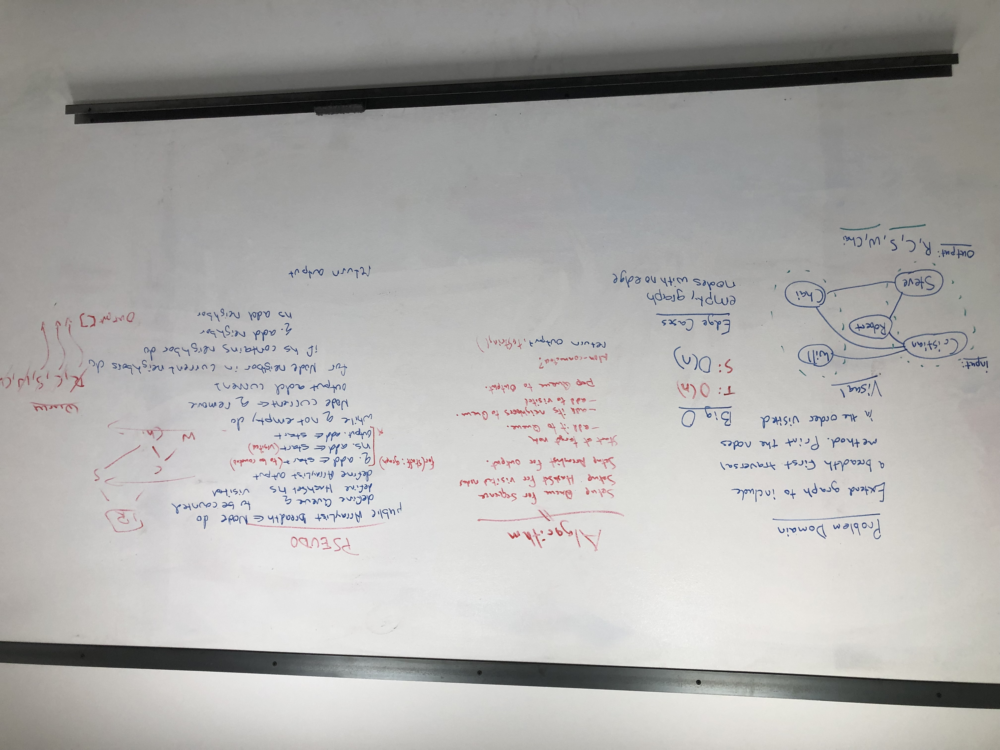

# Graph Implementation
- Implement a graph. The graph should be represented as an adjacency list

## Challenge
- Should be able to add a node to the graph. Adds a new node to the graph, Takes in the value of that node, Returns the added node.
- Add an edge to the graph. Adds a new edge between two nodes in the graph, Include the ability to have a “weight”, Takes in the two nodes to be connected by the edge, Both nodes should already be in the Graph.
- Get all of the nodes in a graph. Returns all of the nodes in the graph as a collection (set, list, or similar).
- Get all the neighbors of a node. Returns a collection of nodes connected to the given node, takes in a given node, Include the weight of the connection in the returned collection.
- Get the size of a graph. Returns the total number of nodes in the graph.                                 
- A breadth-first traversal method that accepts a starting node. Return a collection of nodes in the order they were visited. 

## Approach & Efficiency
- breadthFirstTraversal has a time O(n) and space O(n)

## API and Acknowledgements
- addNeighbor(Node<T> node, int weight)
- depthFirstTraversal(Node startingNode)
- addNode(T data)
- addEdge(Node<T> source, Node<T> destination)
- Michelle's in class example for traversing a graph (in her example it was for size)

## Whiteboard Picture

## Code
- [Graph Implementation Code](../../src/main/java/Java/Graph/Graph.java)

## Test
- [Graph Implementation Test](../../src/test/java/Java/Graph/GraphTest.java)
