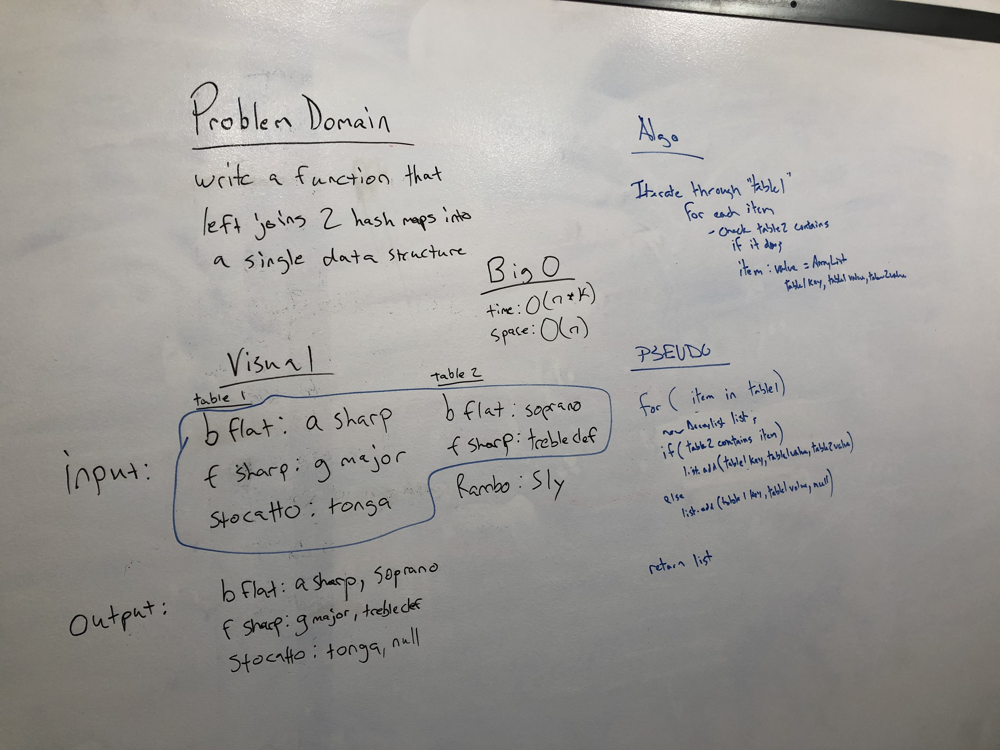

# Hashtables Left Join
- Implement a simplified LEFT JOIN for 2 Hashmaps.

## Challenge
- Write a function that LEFT JOINs two hashmaps into a single data structure.
- The first parameter is a hashmap that has word strings as keys, and a synonym of the key as values.
- The second parameter is a hashmap that has word strings as keys, and antonyms of the key as values.
- Combine the key and corresponding values (if they exist) into a new data structure according to LEFT JOIN logic.

## Approach & Efficiency
- Time efficiency would be O(n*k)
- Space efficiency would be O(n)

## API and Acknowledgements
- leftJoin(HashMap<String, String> leftHashMap, HashMap<String, String> rightHashMap)
- Thank you to Stephen Chu for help with conceptualization and testing and generally pointing me in the right direction
- https://stackoverflow.com/questions/25593733/left-join-of-two-different-java-objects

## Whiteboard Image

## Code
- [HashMap Left Join Code](../../src/main/java/Java/LeftJoin/LeftJoin.java)

## Test
- [HashMap Left Join Test](../../src/test/java/Java/LeftJoin/LeftJoinTest.java)
