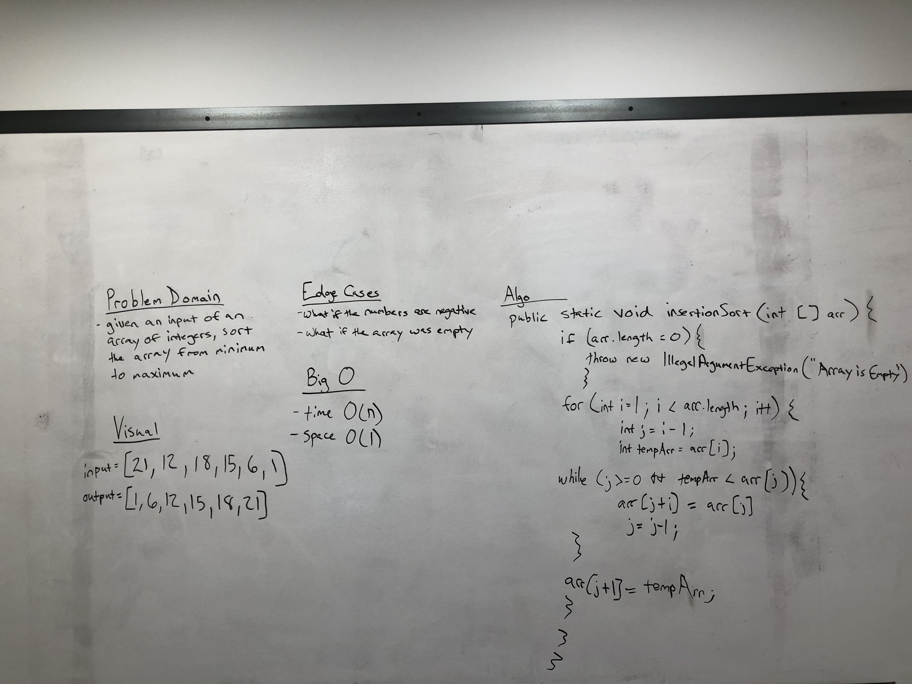

# Insertion Sort Sample Lecture

Writing a method that takes in an array of integers and will sort it from minimum to maximum value.

## Goals:
- Learn what an insertion sort algorithm is and how to code and implement one

## Lecture ToDo List:
- Sorting is a way to organize data based on the parameters given and desired. There are many different ways of sorting.
- The sort that will be taught is for an array of integers and will sort it from minimum to maximum value.
- Go over the problem domain, the visual, the Big O.
- Pseudo Code it out.
- Write the real code, and then test it.
- Think of the edge cases for insertion sort.
- Stress that insertion sort is mainly useful when the array size is smaller.

## Whiteboard


## Algo
- Time of O(n^2)
- Space of O(1)
- Throw an illegal argument exception if the array is empty
- A for loop to the length of the array where the i is 1.
- Within the for loop there will be another variable which is j. One will keep track of the current position and one will advance
- In the while loop, we will check that the j variable is greater than 0 and that the temporary array is less than the input array at j 

## PseudoCode (from assignment on Canvas)
```  InsertionSort(int[] arr)
       
         FOR i = 1 to arr.length
         
           int j <-- i - 1
           int temp <-- arr[i]
           
           WHILE j >= 0 AND temp < arr[j]
             arr[j + 1] <-- arr[j]
             j <-- j - 1
             
           arr[j + 1] <-- temp
   ```

## Code
[Insertion Sort Code](../../src/main/java/Java/InsertionSort/InsertionSort.java)

## Tests
[Insertion Sort Tests](../../src/test/java/Java/InsertionSort/InsertionSortTest.java)

## References
- Video References:
  - [CS Rocks](https://www.youtube.com/watch?v=pmDnM9gUxNc)
  
- Reading References:
  - [Interview Bit](https://www.interviewbit.com/tutorial/insertion-sort-algorithm/)
  - [Hacker Earth](https://www.hackerearth.com/practice/algorithms/sorting/insertion-sort/tutorial/)
