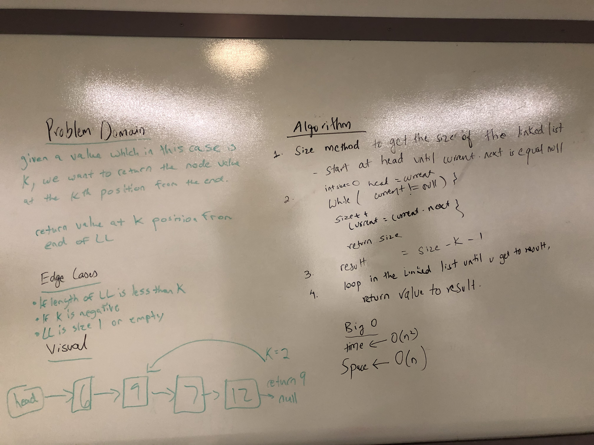

# Singly Linked List
Linked Lists are a data structure that offer certain advantages over array lists

## Challenge
The challenge was to create seven methods. Insert, Includes, Print, Append, InsertBefore, InsertAfter, InsertNFromTheEnd

## Approach & Efficiency
Insert has a Big O(1). All the other methods have a Big O(n)

## API
1. insert will insert a new not with a given value which is an integer to the beginning of a linked list

2. search will return a boolean based on whether your linked list includes the value that was inputted

3. print does not take in any values but returns the values of all the nodes in a linked list

4. append inserts a value to the end of the linked list

5. insert before will insert a given value before another given value if it is in the linked list

6. insert after will insert a given value after another given value if it is in the linked list

7. insert n from the end will take in an integer k and return the value at the position k places from the end

## Solution

- [Linked List Code](../../src/main/java/Java/LinkedList/LinkedList.java)

- [Linked List Test](../../src/test/java/Java/LinkedList/LinkedListTest.java)