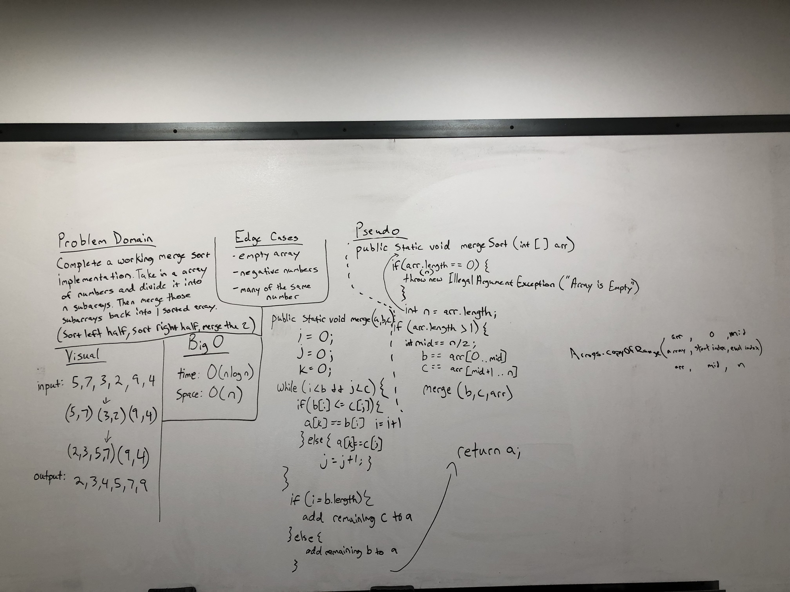

# Merge Sort Sample Lecture
- Given an array of the type of integer, Complete a working merge sort implementation. Take in an
array of integers and divide it into n sub arrays. Then merge those sub arrays back into 1 sorted array.
(sort the left half, sort the right half, and then merge the 2 halfs)

## Goals:
- Learn what a merge sort algorithm is and how to code and implement one.

## Lecture ToDo List:
- Sorting is a way to organize data based on the parameters given and desired. There are many different ways of sorting.
- The sort that will be taught is for an array of integers and will sort it from minimum to maximum value.
- Go over the problem domain, the visual, the Big O.
- Pseudo Code it out.
- Write the real code, and then test it.
- Think of the edge cases for insertion sort.

## Whiteboard


## Algo
- Time of O(nlogn)
- Space of O(n)
- Throw an illegal argument exception if the array is empty
- If the length of the array is greater than 1 we will split it at the midpoint
- Then we will call the mergeSort method recursively on the two halves.
- Finally we will call the merge method on the two halves.
- In the merge method, we will have three variable to keep track of indexes. 
- By comparing the sub arrays at these indexes we will add the numbers in a sorted manner back into the 
final array which we will return. 

## PseudoCode (from assignment on Canvas)
```  ALGORITHM Mergesort(arr)
         DECLARE n <-- arr.length
                
         if arr.length > 1
           DECLARE mid <-- n/2
           DECLARE b <-- arr[0...mid]
           DECLARE c <-- arr[mid...n]
           // break down the left side
           Mergesort(b)
           // break down the right side
           Mergesort(c)
           // merge the left and the right side together
           Merge(b, c, arr)
     
     ALGORITHM Merge(b, c, a)
         DECLARE i <-- 0
         DECLARE j <-- 0
         DECLARE k <-- 0
     
         while i < b && j < c
             if b[i] <= c[j]
                 a[k] <-- b[i]
                 i <-- i + 1
             else
                 a[k] = c[j]
                 j <-- j + 1
                 
             k <-- k + 1
     
         if i = b.length
            add remaining items in array c to array a
         else
            add remaining items in array b to array a
            
         return a
   ```

## Code
[Merge Sort Code](../../src/main/java/Java/MergeSort/MergeSort.java)

## Tests
[Insertion Sort Tests](../../src/test/java/Java/MergeSort/MergeSortTest.java)

## References
- Video References:
  - [Hacker Rank](https://www.youtube.com/watch?v=KF2j-9iSf4Q)
  
- Reading References:
  - [Interview Bit](https://www.interviewbit.com/tutorial/merge-sort-algorithm/)
  - [Techie Delight](https://www.techiedelight.com/merge-sort/)
