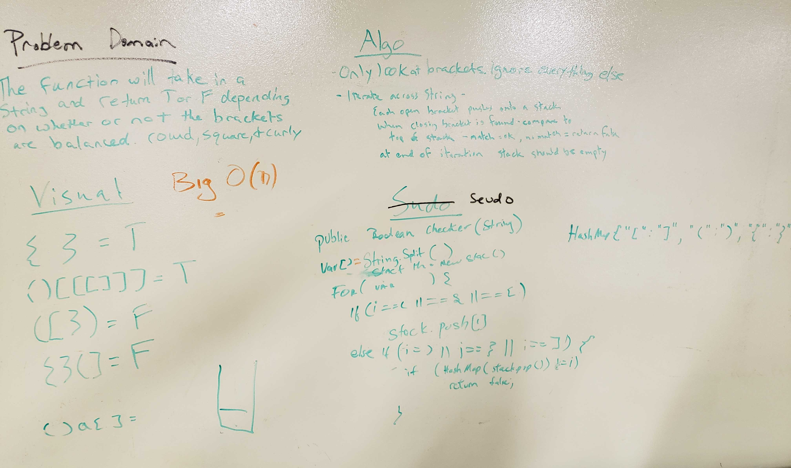

#MultiBracketValidation
A function should take a string as its only argument, and should return a boolean representing whether or not the brackets in the string are balanced. There are 3 types of brackets:
- Round Brackets : ()
- Square Brackets : []
- Curly Brackets : {}

## API
- nothingHere(): checks if nothing is in the stack
- pairsAreMatching(): checks if the open brackets have a closing bracket
- multiBracketValidation(String input): the main method with logic to take

## Big O
- Time and Space O(n)

## Acknowledgments
- Geeks for Geeks

## Solution

- [multibracketvalidation Code](../../src/main/java/Java/multibracketvalidation/multiBracketValidation.java)

- [multibracketvalidation Test](../../src/test/java/Java/multibracketvalidation/multiBracketValidationTest.java)