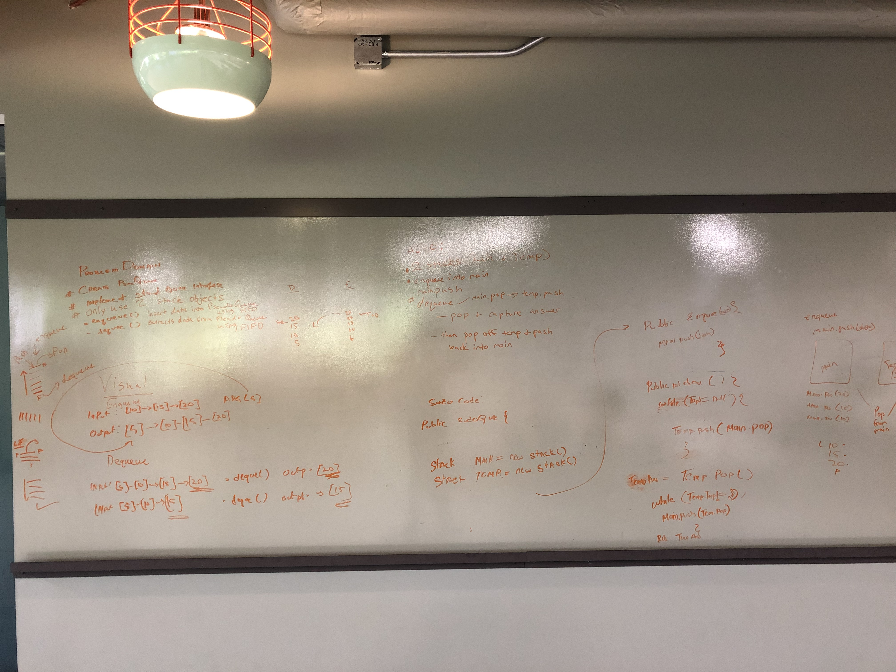

#PseudoQueue
- Implement a Stack data structure that behaves like a Queue

## API
- enqueue(value) which inserts value into the PseudoQueue, using a first-in, first-out approach.
- dequeue() which extracts a value from the PseudoQueue, using a first-in, first-out approach.

## Big O
- Enqueue has a O(1)
- Dequeue has a O(n)

## Acknowledgements
1. Thanks Robert Bronson for helping me out with understanding the problem

## Solution

- [PseudoQueue Code](../../src/main/java/Java/queueWithStacks/PseudoQueue.java)

- [PseudoQueue Test](../../src/test/java/Java/queueWithStacks/PseudoQueueTest.java)