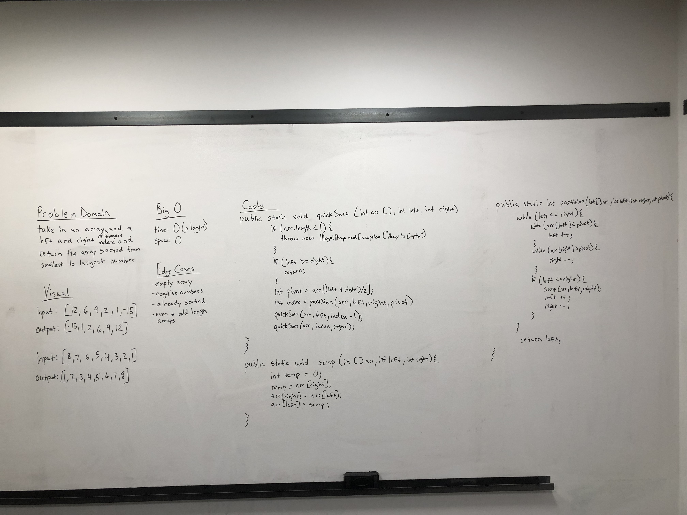

# Quick Sort
- Given an array of the type of integer, Complete a working quick sort implementation. Take in an
array of integers and a left and right index. Then sort that array using a pivot as well as a partition and swap
method.  

## Challenge
- First we need to check that the array is not an empty array.
- Then pick a pivot and walk through the array from left to right and right to left and swap the elements
if they are out of order. 
- Everything to the left of the pivot is smaller than the pivot and everything to the right of the pivot is
larger than the pivot. 
- Then we do quickSort on the two halves
- The quickSort method step is done recursively.
- Return the sorted array

## Approach & Efficiency
- Time of O(nlog(n)) or O(n^2) in a worst case scenario
- Space of O(log(n))
- Throw an illegal argument exception if the array is empty.

## API
- ```quickSort(int[] arr, int left, int right)```
- ```partition (int[] arr, int left, int right, int pivot)```
- ```swap(int [] arr, int left, int right)```

## Acknowledgements/Resources
- Geeks for Geeks
  - https://www.geeksforgeeks.org/java-program-for-quicksort/
- Program Creek
  - https://www.programcreek.com/2012/11/quicksort-array-in-java/
- Robert Bronson for helping me understand it a little better high level

## Code
[Quick Sort Code](../../src/main/java/Java/QuickSort/QuickSort.java)

## Tests
[Merge Sort Tests](../../src/test/java/Java/QuickSort/QuickSortTest.java)

## Whiteboard Picture


## Sample Lecture
- [Quick Sort Sample Lecture](./QuickSortSampleLecture.md)