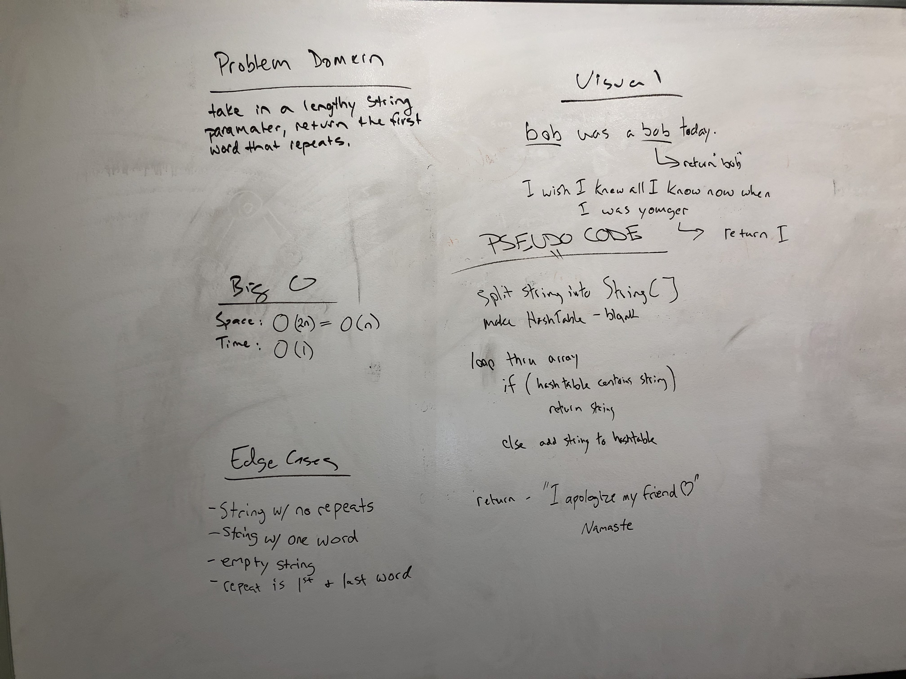

# Repeat Word
- Find and return the first repeated word in a lengthy string

## Challenge
- Write a function that accepts a lengthy string parameter.
- Without utilizing any of the built-in library methods available to your language, return the first word to occur more than once in that provided string.

## Approach & Efficiency
- Space: O(2n) which is O(n)
- Time: O(1)

## API and Acknowledgements
- repeatWord(String input)
- https://stackoverflow.com/questions/18830813/how-can-i-remove-punctuation-from-input-text-in-java
- Stephen Chu for Regex assistance

## Whiteboard Picture

## Code
- [Repeat Word Code](../../src/main/java/Java/RepeatWord/RepeatWord.java)

## Test
- [Repeat Word Test](../../src/test/java/Java/RepeatWord/RepeatWordTest.java)

