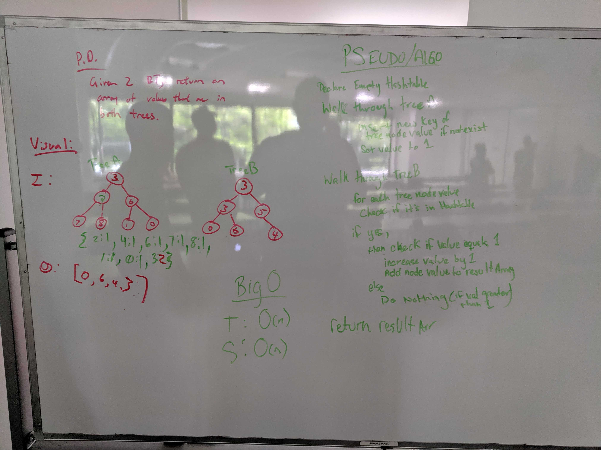

# Tree Intersection
- Find common values in 2 binary trees.

## Challenge
- Write a function called tree_intersection that takes two binary tree parameters.
- Without utilizing any of the built-in library methods available to your language, return a set of values found in both trees.

## Approach & Efficiency
- Space: O(n)
- Time: O(n)

## API and Acknowledgements
- 

## Whiteboard Picture

## Code
- [Tree Intersection Code](../../src/main/java/Java/TreeIntersection/TreeIntersection.java)

## Test
- [Tree Intersection Test](../../src/test/java/Java/TreeIntersection/TreeIntersectionTest.java)

