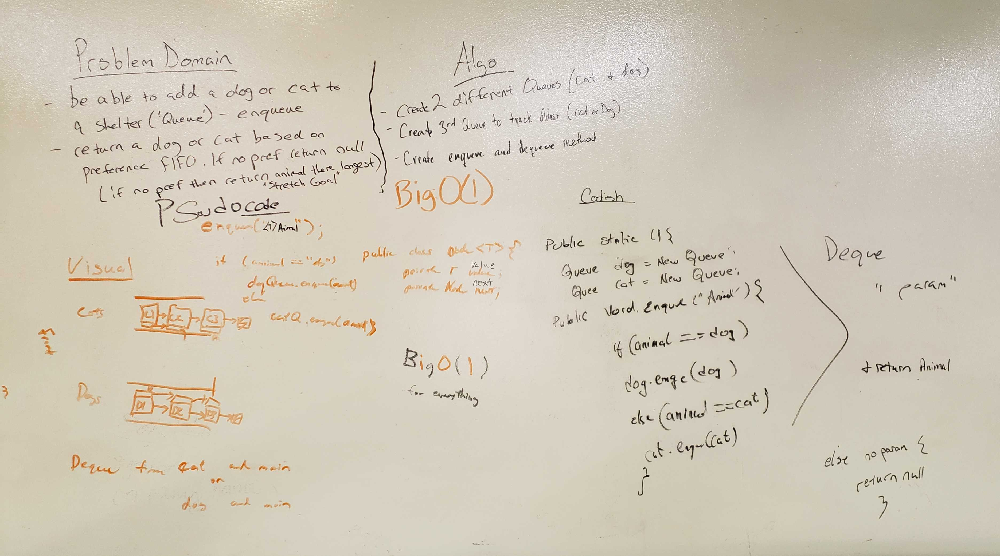

#fifoAnimalShelter
- create a class called AnimalShelter which holds only dogs and cats. The shelter operates using a first-in, first-out approach. 

## API
- enqueue(animal): adds animal to the shelter. animal can be either a dog or a cat object.
- dequeue(pref): returns either a dog or a cat. If pref is not "dog" or "cat" then return null.

## Big O
- Enqueue(animal) has a O(1)
- Dequeue(pref) has a O(1)

## Acknowledgments
- Thanks to Will Fritts for helping me understand hot potato with the dequeue method

## Solution

- [fifoAnimalShelter Code](../../src/main/java/Java/fifoAnimalShelter/AnimalShelter.java)

- [fifoAnimalShelter Test](../../src/test/java/Java/queueWithStacks/AnimalShelterTest.java)